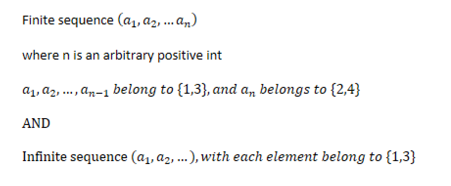
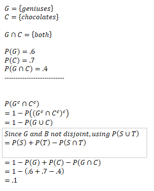
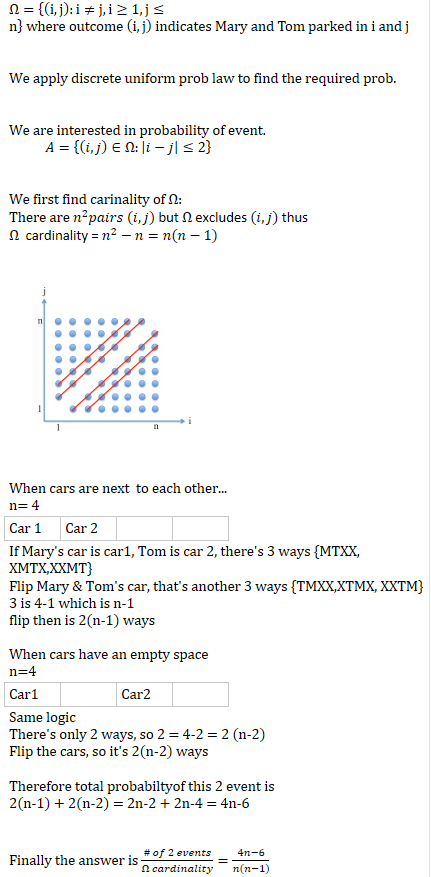
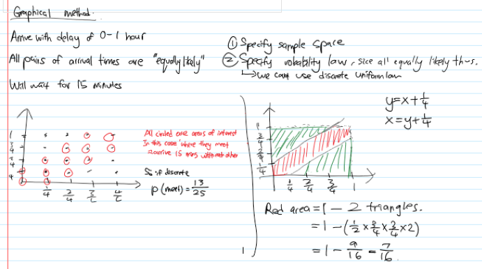
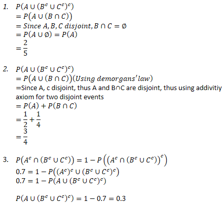

# Unit 1: Probablity models and axioms
---
# Notes

## Sets 

### Properties and Operations

* $S \cup T = T \cup S$
* $S\cup (T \cup U) = S\cup T \cup U = (S\cup T) \cup U$
* $S \cap (T\cup U) = (S \cap T) \cup (S\cap U)$
* $S \cup (T\cap U) = (S\cup T)\cap(S\cup U)$
* $(S^c)^c = S$ 
* $S\cup S^c = \emptyset$
* $S\cup \Omega = \Omega$

* $\bigcup_{n=1}^\infty S_n = S_1 \cup S_2 \cup ... = \{x|x\in S_n \text{for some n}\}$

* $\bigcap_{n=1}^\infty S_n = S_1 \cap S_2 \cap ... = \{x|x \in S_n \text{for all n}\}$

### De Morgan's Law
* $(S\cap T)^c = S^c \cup T^c $
* $(S\cup T)^c = S^c \cap T^c $
* $S\cup T = (S^c \cap T^c)^c$

* To apply it generally on multiple sets,
  * $(\bigcup_n S_n)^c = \bigcap_n S_n^c$
    * $(S_1 \cap S_2 ...)^c = S_1^c \cup S_2^c \cup ...$
  * $(\bigcap_n S_n)^c = \bigcup _n S_n^c $

## Set Probability

### De Morgan's Law
* $P(X\cup Y) = 1 - P((X\cup Y)^c) = 1 - P(X^c \cap Y^c)$
* $P(X^c \cap Y^c) = 1 - P((X^c \cap Y^c)^c) = 1 - P(X\cup Y)$
* $P((A\cap B)^c) = 1 - P(A\cap B)$
* $P(A^c) = 1 - P(A)$

### Probability Axioms
* If A and B is disjoint, then:
  $\newline P(A\cup B) = P(A) + P(B) (Additivity)$
* If $\Omega$ is infinite and $A_1,A_2,...$ is a sequence of disjoint events
  $\newline P(A_1 \cup A_2 \cup ...) = P(A_1) + P(A_2) + ...$
* Nonnegativity: $P(A)>=0$
* Normalization: $P(\Omega) = 1$

### Properties
Consider a probability law, and let $A,B,C$ be events:  
* If $A\subset B$, then $P(A) <=P(B)$
* $P(A \cup B) = P(A) + P(B) - P(A \cap B)$
* $P(A \cup B) <= P(A) + P(B)$ (Union Bound)
* $P(A \cap B) >= P(A) + P(B) - 1$ (Benferroni inequality)
* $P(A_1 \cap ... \cap A_n) >= P(A_1) + ... + P(A_n) - (n-1)$ (Benferroni inequality)
* $P(A \cup B \cup C) = P(A) + P(A^c \cup B) + P(A^c \cup B^c \cup C)$

### Discrete uniform probability law
If $\Omega$ consist n possible outcomes, all equally likely,  
* $P(A) = \dfrac{number\space of\space elements\space of\space A}{n}$

--- 
# Problems

## Flip a fair coin
You flip a fair coin (i.e, the probability of obtaining heads is 1/2) three times. Assume that all sequences of coin flip results, of length 3, are equally likely. Determine the probability of each of the following events.

1. {HHH}: 3 heads
2. {HTH}
3. Any sequence with 2 heads and 1 tail.
4. Any sequence in which number of heads is greater than or equal to number of tails.

  
Solution

1. $\dfrac 1 2 * \dfrac 1 2 * \dfrac 1 2 = \dfrac 1 8$

2. $\dfrac 1 2 * \dfrac 1 2 * \dfrac 1 2 = \dfrac 1 8$

3. $P(2H1T) \newline
  = \dfrac{number\space of\space events}{number\space of\space \Omega} \newline
  = \dfrac{HHT,HTH,THH}{2^3} \newline
  = \dfrac 3 8$

## Four sided die
A four sided die is rolled repeatedly, until the first time (if ever) that an even number is obtained. What is the sample space for this experiment?

  
Solution

## Genius and Chocolates
Out of the students in a class, 60% are geniuses, 70% love chocolate, and 40% fall into both categories. Determine the probability that a randomly selected student is neither a genius nor a chocolate lover.

  
Solution

## Mary and Tom Car Park
Mary and Tom park their cars in an empty parking lot with  consecutive parking spaces (i.e,  spaces in a row, where only one car fits in each space). Mary and Tom pick parking spaces at random; of course, they must each choose a different space. (All pairs of distinct parking spaces are equally likely.) What is the probability that there is at most one empty parking space between them?

  
Solution

## Romeo and Juliet
Uniform probabilitie s on a square. Romeo and Juliet have a date at a given time, and each will arrive at the meeting place with a delay between 0 and 1 hour, with all pairs of delays being "equally likely", that is, according to a uniform probability law on the unit square. The first to arrive will wait for 15 mintues and will leave if the other has not arrived. What is the probabiliyt that they will meet?

  
Solution

## Set Operations
Find the value of $P(A∪(B^c∪C^c )^c )$  for each cases:

  1. The events A,B,C are disjoint events and $P(A) = \dfrac 2 5$
  2. The events A & C are disjoint, $P(A)= \dfrac 1 2, P(B)=\dfrac 1 4$
  3. Given $P(A^c∩(B^c∪C^c ))=0.7$, What is $P(A∪(B^c∪C^c )^c )?$

  
Solution

