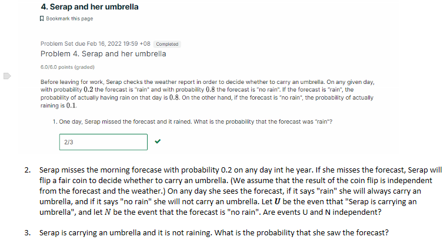

# Unit 2: Conditioning
---

# Notes

## Multiplication Rule
$P(A\cap B) \\
= P(A) * P(B|A) \\
= P(B) * P(A|B)$

## Total Probability Theorem
$
P(B) = P(A \cap B) + P(A^c \cap B)
$

## Bayes Rules
$
P(A|B) = \dfrac {P(A\cap B)} {P(B)}
$

---
# Problems

## Oscar's Lost Dog

- b. Oscar lookedin forest A on the first day but didn't find his dog. What is the probability that the dog is in forest A?
- c. Oscar flips a fair coin to determine where to look on the first day and finds the dog on the first day. What is the probability that he looked in forest A?
- d. Oscar decides to look in forest A for the first two days, what is the probability that he finds his dog alive for the first time on the second day?
- e. Oscar decides to look in forest A for the first two days. Given that he did not find his dog on the first day, find the probability that he does not find his dog dead on the second day.
- f. Oscar finally finds his dog on the fourth day of the search. He looked in forest A for the first 3 days and in forest B on the foruth day. given this information, what is the probability that he found his dog alive?

  
Solution

## Serap and Her Umbrella

  
Solution

