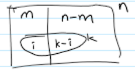
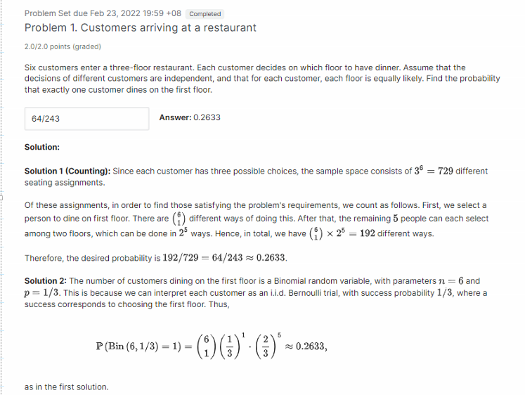

# Unit 3: Conditioning and Independence
---
# Notes

## Basic Counting Principle

$r$ stages
$n_i$ choices at stage $i$

Number of choice is $n_1 * n_3 * ... * n_r$

## Permutations

**Given n in a set, how many permutations without repetition?**

$$n!$$
$$AB = \{AB,BA\}$$

**Given n in a set, choose k, how many permutations without repetitions?  (k-permutation)**

$$\dfrac {n!}{(n-k)!} = nPk$$
$$ABC = \{AB,AC,BA,BC,CA,CB\}$$

**Given n in a set, how many permutations with repetition?**

$$n^r$$
$$AB = \{AA,AB,BA,BB\}$$

**Given n in a set, how many subsets?**

$$2^n$$
$$AB = \{A,B,AB,BA\}$$

**How many ways can ARRANGEMENT be arranged?**

There are 2A's, 2R's, 2N's, 2E's, 11 letters
$$\dfrac{11!}{2!2!2!2!}$$

## Combinations

**Given n in a set, choose k, how many combinations?** 
**(Binomial Coefficient)**

$${n \choose k} = \dfrac{n!}{k!(n-k!)}$$
$$\text{ABC choose 2} = {AB,BC,AC}$$
$$\text{10 toin coss, 2 heads} = {10 \choose 2} = \text{45 possible sequences}$$
$$\sum_{k=0}^{n}{n \choose k} = {n \choose 0}+{n \choose 1}+...+{n \choose n} = \text{\# of all subsets} = 2^n$$

**Binomial Probability:**  
Given $n>=1$ independent event out of 2 outcomes $A,B,$ thus  
$P(A) = p, P(B) = 1-p$   
$P($k occurences of $A ($or $B)$ out of n$)?$  
So for k heads out of n coin toss would be:  
$P(k heads) = {n \choose k}p^k(1-p)^{n-k}$

  

**Given n in a set, partitioned to r, how many ways to distribute n to r? (ways to partition set into subsets of prescribed sizes $n_1, n_2, ..., n_r)$** 
**Partitions (Multinomial Coefficient)**

$$\text{number of different partitions} = \dfrac{n!}{n_1!n_2!...n_r!}$$
$$\dfrac{9!}{2!3!4!} = {9 \choose 2}{7 \choose 3}{4 \choose 4}$$

**Multinomial Probability:**  
Given a set, with r types,  
Each type is identified with i = 1,2,...,r.  
Each type has its own probability $p_i$, which $\sum_{i=1}^{r} p_i = 1$

We choose n times  
$P(n_1 \text{of type 1},n_2 \text{of type 2},...,n_r \text{of type r})$
where $n_1 + ... + n_r = n$

$= \dfrac{n!}{n_1!n_2!n_3!}p_1^{n_1}p_2^{n_2}...p_r^{n_r}$

**HyperGeometric Probability**

Given n with m type of interest. Choose k.  
$P(\text{i of k is m})?$  
  
$P(\text{i balls are red}) = \dfrac{c}{|\Omega|} = \dfrac{{m \choose i}{n-m \choose k-i}}{{n \choose k}}$

# Problems

## Customers arriving at a restaurant

## Committee
Out of five men and five women, we form a committee consisting of four different people. Assuming that each committee of size four is equally likely, find the probabilities of the following events:
1. The committee consists of two men and two women.
2. More women than man

  
Solution

1. $P(2M2W) = \dfrac{{5 \choose 2}{5 \choose 2}}{{10 \choose 4}} = \dfrac{10}{21}$
2. $P(W>M)$  $= P(3W1M) + P(4W)$  = $\dfrac{{5 \choose 3}{5 \choose 1}}{10\choose 4} + \dfrac{5 \choose 4}{10\choose 4}$  $= \dfrac{11}{42}$

