# Unit 4 and 5: Discrete and Continuous Random Variables
---
# Notes

## Events
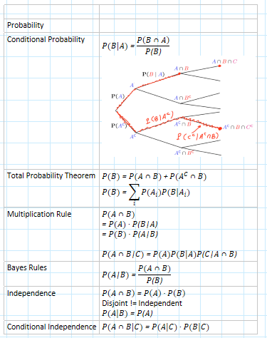
## Random Variables
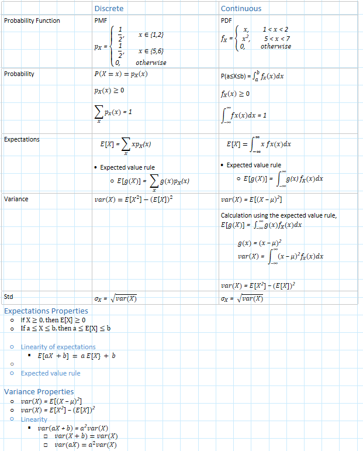
## Discrete Distributions
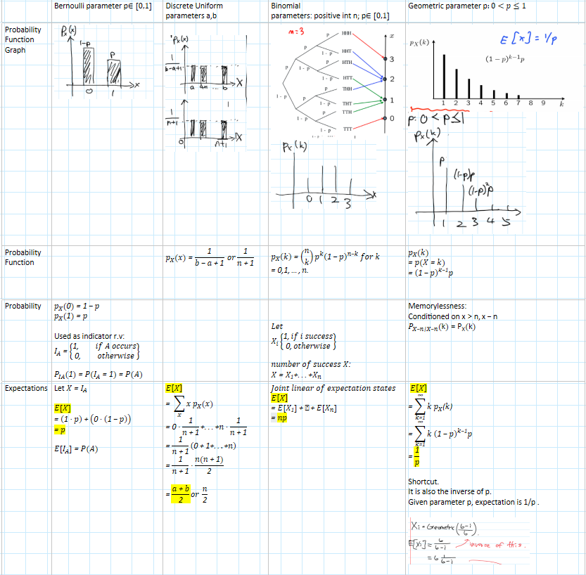
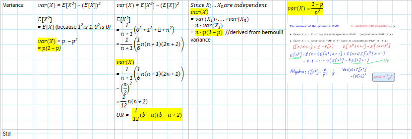
## Continuous Distributions
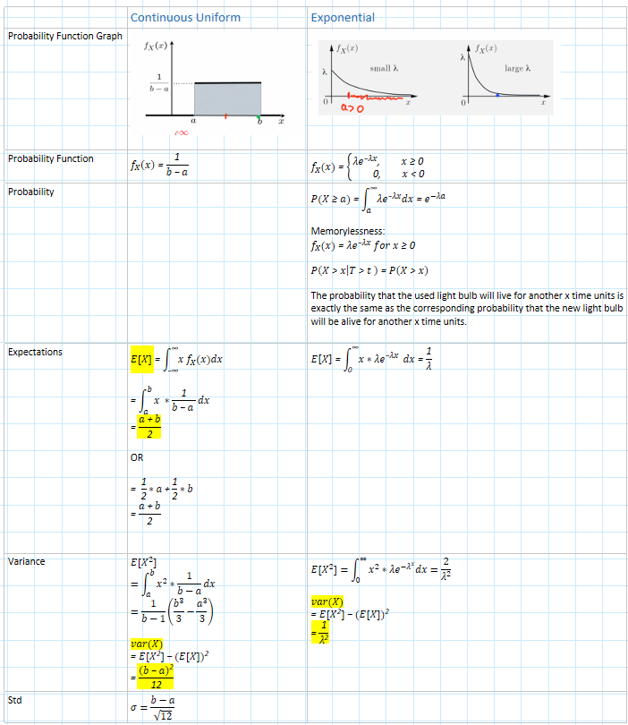
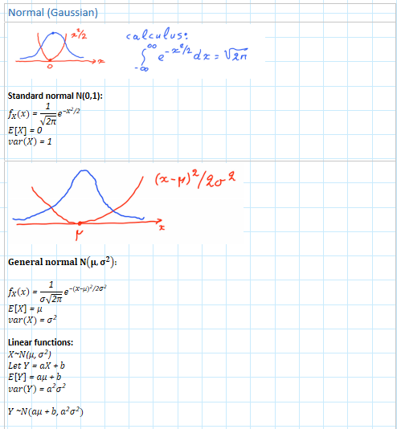
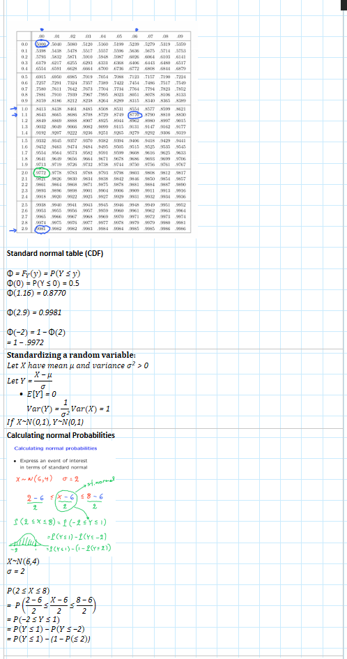
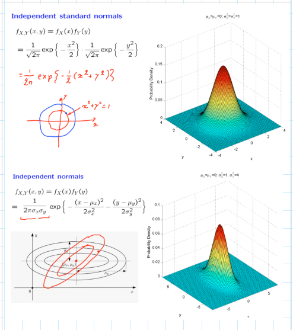
## Cumulative Distributions Functions (CDF)
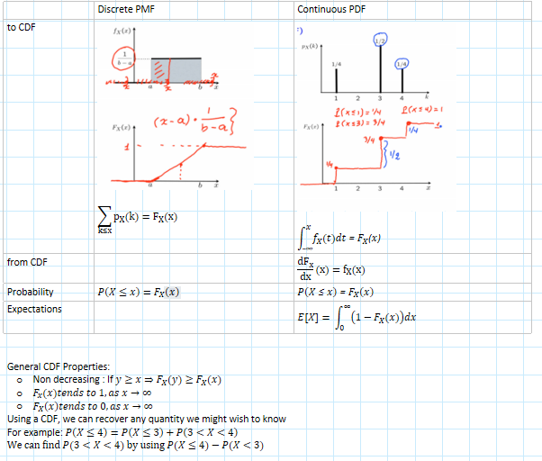
## Mixed R.V Distributions
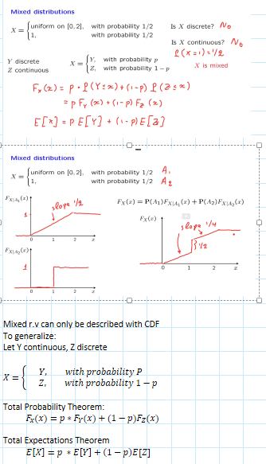
## Conditioning on events
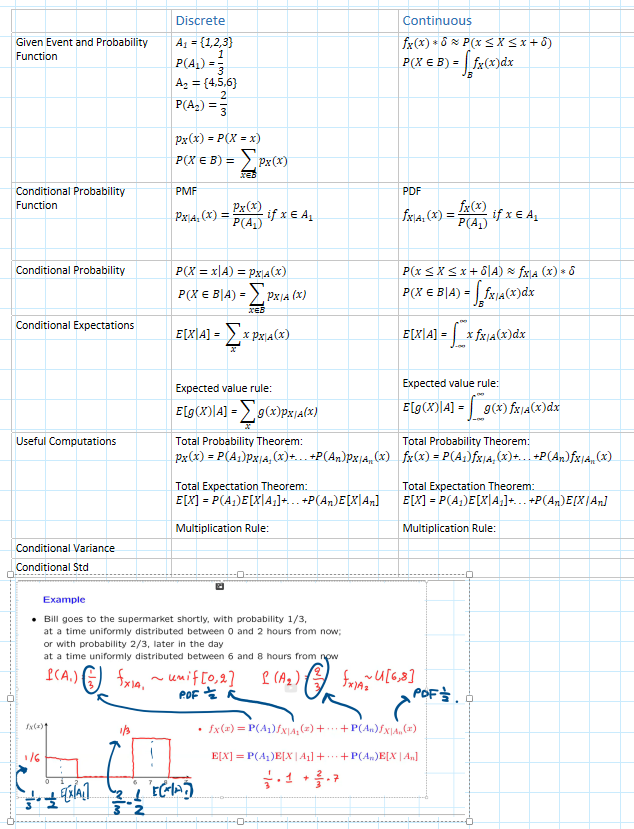
## Joint Notation
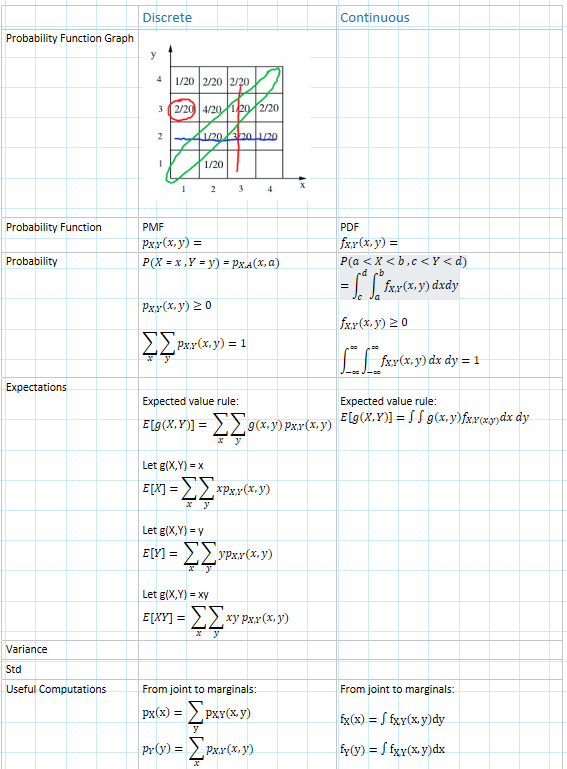
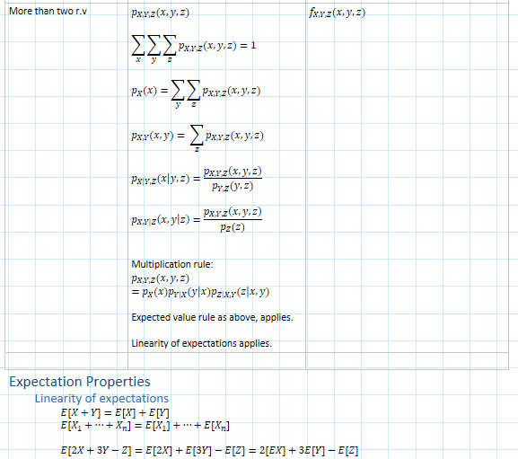
## Joint CDF
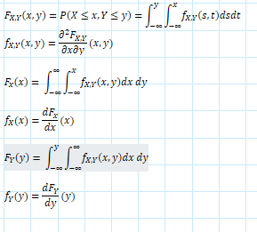
## Conditioning on random variables
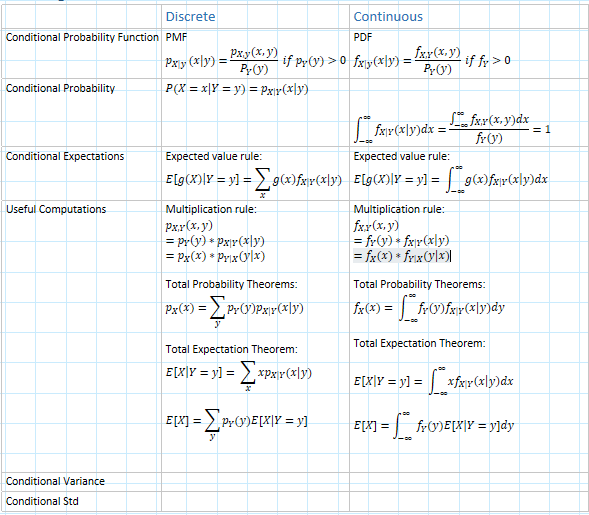
## Independence
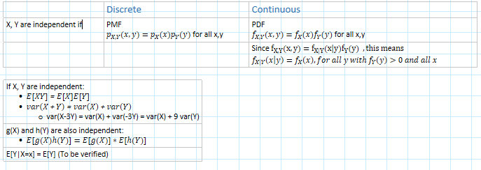
## Conditional Independence
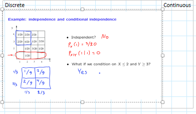

## Bayes Rules
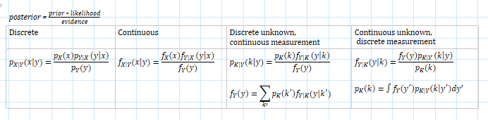

### Discrete Unknown, Continuous measurement
#### Detection of a binary signal
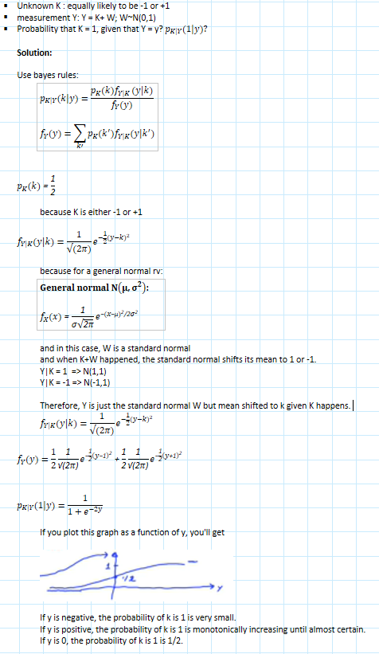

### Continuous Unknown, Discrete measurement
#### Inference of a bias of a coin
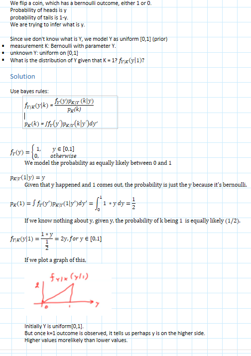

# Discrete RV Problems

## Indicator Variable (Coin Toss)
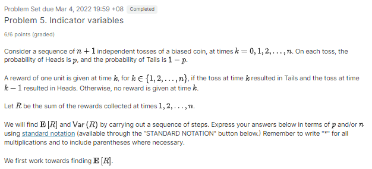
1. Let $I_k$ denote the reward (possibly 0) given at time $k$, for $k \in \{1,2,...,n\}$. Find $E[I_k].$
2. Using the answer to part 1, find E[R].
   The variance calculation is more involved because the random variables $I_1,I_2,...,I_n$ are not independent. We begin by computing the following values.
3. If $k \in \{1,2,...,n\}$, then $E[I_k^2] = $
4. If $k \in \{1,2,...,n-1\}$, then $E[I_{k}I_{k+1}] =$
5. If $k >=1, \ell >=2,$ and $k + \ell <=n$, then $E[I_{k}I_{k+\ell}] = $
6. Using the results above, calculate the numerical value of $Var(R)$, assuming that $p=\dfrac{3}{4}, n = 10$.

  
Solution

Definition:
- $n + 1$ tosses
- times $k=\{0,1,2,...,n\}$
- probability Heads = $p$, probability Tails = $1-p$

- At time $k \in \{1,2,...,n\}$
   - reward given if time $k$ = Tails and time $k-1$ = Heads
   - $I_k$:reward given at time $k$ 
   - R: sum of rewards collected 

Computation:
1. $E[I_k]$  
   $= P(I_k = 1)$  
   $= P(\text{Tails at time k and Heads at time k-1})$  
   $= p*(1-p)$  

2. $E[R]$  
   By linearity of expectations, 
   $= E[\sum_{k=1}^{n}I_k] = \sum_{k=1}^{n}E[I_k] = n*p*(1-p)$
3. $E[I_k^2]$  
   Since $I_k$ is a bernoulli and $0^2 =0$ and $1^2 = 1$,  
   $= E[I_k]$  
   $= p * (1-p)$

4. $E[I_kI_k+1]$  
   $I_k$ and $I_k+1$ cannot be both 1; because when either is 1, it implies the other is 0. And since $1 * 0 = 0$, therefore the expectation  
   $= 0$

5. $E[I_kI_{k+\ell}]$  
   Since they are two period apart, and are independent  
   $= E[I_k]E[I_{k+\ell}$
   $= p^2(1-p)^2$
   
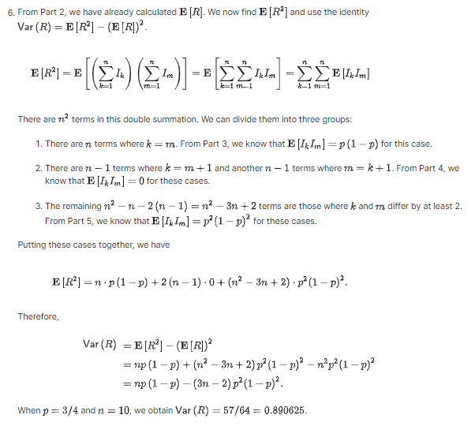

# Continuous RV Problems

## Sophia's Vacation
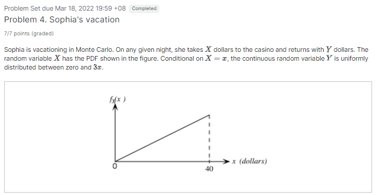
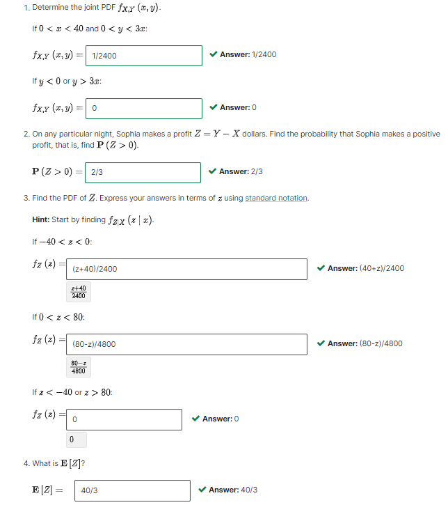

  
Solution

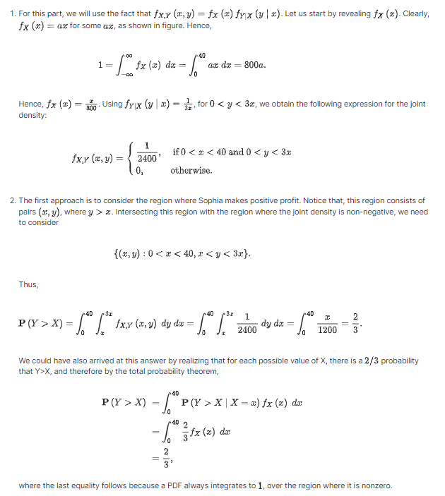
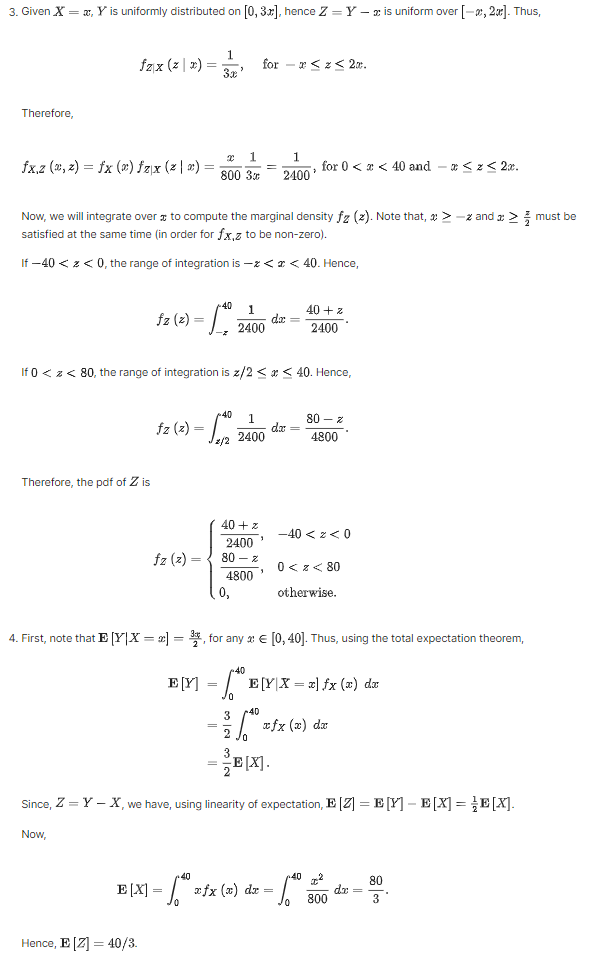

